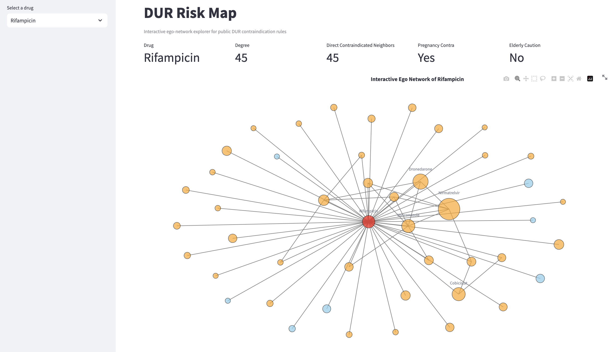
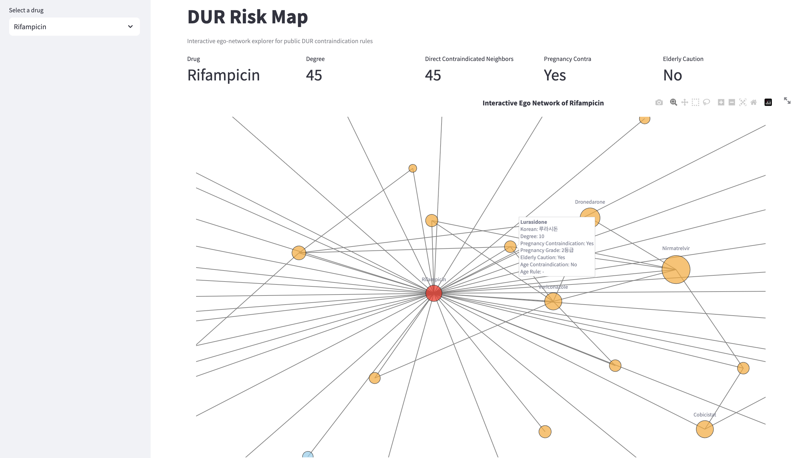
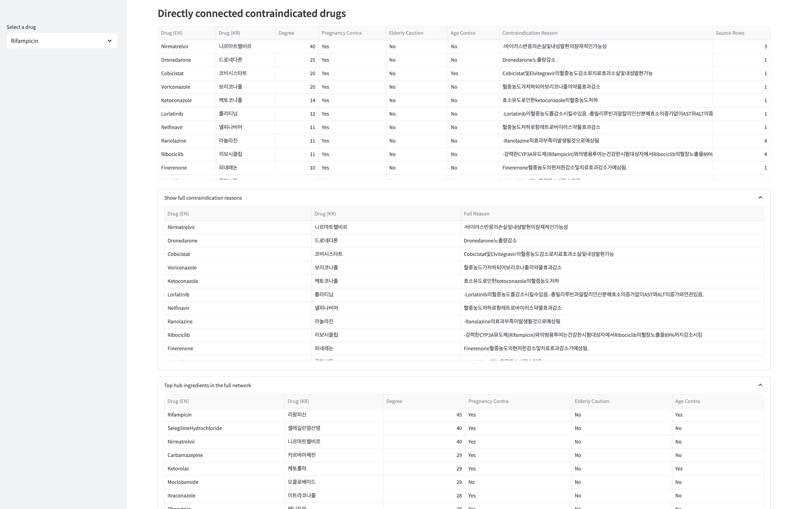

# DUR Risk Map

An interactive ego-network explorer built from public Korean DUR contraindication data.

## Overview

DUR Risk Map is a prototype that transforms public ingredient-level DUR (Drug Utilization Review) data into an interactive graph structure.

Instead of reading raw contraindication tables row by row, users can:

- select an ingredient
- inspect its directly contraindicated neighbors
- review contraindication reasons
- identify whether connected drugs are flagged for vulnerable populations such as pregnancy, elderly use, or age-related contraindications

The current prototype focuses on **ingredient-level ego-network exploration** rather than full-network clinical decision support.

## Why this project?

Public DUR data is highly valuable, but it is not immediately graph-ready.

In particular:

- the raw AC contraindication file is **not** a one-row-per-pair table
- repeated ingredient pairs appear across multiple rows
- the same pair may differ by direction pattern, detailed rule record, or update history
- vulnerable-population information is distributed across separate DUR files

This project addresses that by constructing:

- a canonical pair-based contraindication edge table
- a node table with overlay metadata
- an interactive ego-network view for selected ingredients

## Current Features

- interactive drug selection
- ego-network visualization centered on a selected ingredient
- node coloring by vulnerable-population overlay
- node sizing by degree
- directly connected contraindicated drug table
- contraindication reason preview with expandable detailed view
- top hub summary table

## Screenshots

### Main app view


### Interactive hover


### Neighbor table


## Data Sources

The current MVP uses the following public Korean DUR ingredient-level datasets:

- `OpenData_PotOpenDurIngr_AC20260312.csv` — contraindicated combinations
- `OpenData_PotOpenDurIngr_BC20260312.csv` — age-related contraindications
- `OpenData_PotOpenDurIngr_CC20260312.csv` — pregnancy contraindications
- `OpenData_PotOpenDurIngr_FC20260312.csv` — elderly cautions

## Method

### 1. Edge construction
The raw AC contraindication dataset is transformed into a canonical pair-based edge table.

- ingredient identity is defined by ingredient code
- display labels use English ingredient names, with Korean fallback when needed
- A-B and B-A are treated as the same undirected edge
- repeated raw rows are aggregated at the canonical pair level
- contraindication reasons are combined into a single edge attribute
- raw row count is preserved as metadata

### 2. Node construction
A node table is created from all unique source and target ingredients appearing in the edge table.

Each node includes:

- ingredient code
- English label
- Korean label
- degree (number of directly connected contraindicated ingredients)

### 3. Overlay metadata
Additional DUR datasets are merged into the node table:

- BC → age-related contraindication
- CC → pregnancy contraindication
- FC → elderly caution

These overlays enrich interpretation of nodes in the ego-network view.

### 4. Graph representation
A NetworkX graph is built from the edge and node tables.

- nodes store degree and overlay attributes
- edges store aggregated contraindication reason and raw row count

### 5. App interface
A Streamlit prototype provides:

- drug selector
- summary cards
- interactive Plotly ego-network
- directly connected contraindicated drug table
- expandable tables for full reasons and top hubs

## Example Interpretation

A high-degree ingredient such as **Rifampicin** appears as a network hub because it is directly contraindicated with many other ingredients.

This does **not** mean it is the single most clinically dangerous drug overall.  
Rather, it indicates that under the current public DUR rules, it has many direct contraindication connections in the graph.

## Limitations

- This is a graph exploration tool, not a real-world prescribing decision support system.
- Degree reflects network connectivity, not absolute clinical risk.
- The current prototype focuses on ego-network visualization rather than full-network exploration.
- Some contraindication reasons are long and still need better formatting.
- Not all DUR categories are integrated yet (for example, GC / DC / EC are not included in the current MVP).

## Project Structure

```text
dur-network-visualization/
├── app.py
├── data/
│   ├── raw/
│   │   ├── OpenData_PotOpenDurIngr_AC20260312.csv
│   │   ├── OpenData_PotOpenDurIngr_BC20260312.csv
│   │   ├── OpenData_PotOpenDurIngr_CC20260312.csv
│   │   └── OpenData_PotOpenDurIngr_FC20260312.csv
│   └── processed/
├── notebooks/
├── docs/
│   ├── 05_dev_log.md
│   └── screenshots/
│       ├── 01_home_rifampicin.png
│       ├── 02_interactive_hover.png
│       └── 03_neighbors_table.png
├── requirements.txt
└── README.md

```

## Installation

Create and activate a virtual environment:

```bash
python3 -m venv .venv
source .venv/bin/activate
```

Install dependencies:

```bash
pip install -r requirements.txt
```

## Run the App

```bash
streamlit run app.py
```

Then open the local Streamlit URL shown in the terminal.

## Future Work

- add GC overlay (therapeutic duplication)
- add filtering options for pregnancy / elderly / age-related flags
- improve text readability of contraindication reasons
- support full-network or multi-hop exploration
- deploy the prototype for online access

## Author Notes

This project was built to explore how public Korean DUR rule tables can be reframed as an interactive graph structure for more intuitive medication safety exploration.